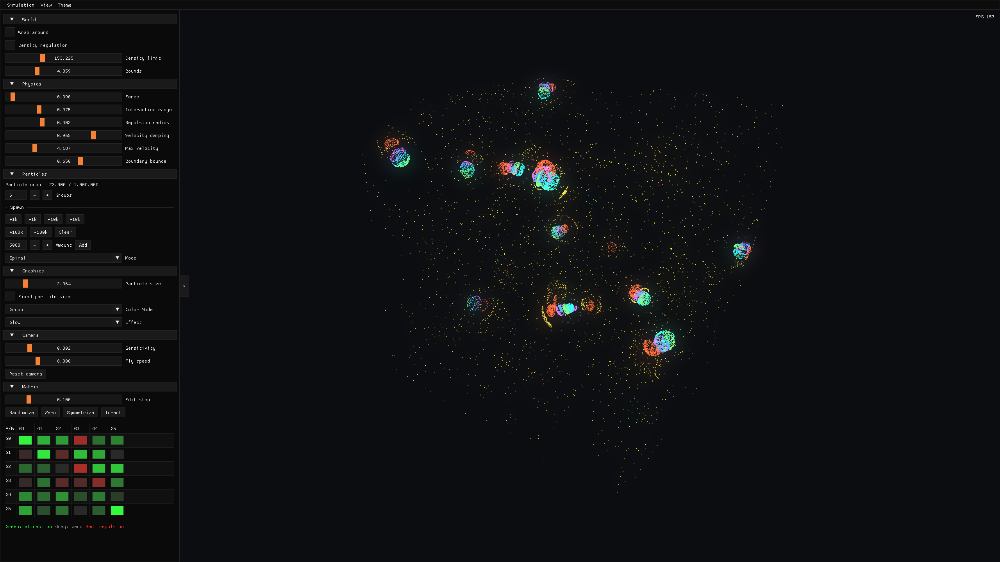

# 3D Particle Simulator

An interactive 3D particle-life sandbox built in Java. It simulates thousands of small particles that attract, repel, cluster, drift apart, and sometimes form surprisingly organic patterns.



This project is inspired by **Particle Life** by **Tom Mohr**, extended here into 3D.

## What It Is

Particle life is a simple idea with complex results: each particle belongs to a group, and each group has its own relationship with every other group. One color might be attracted to another, pushed away by a third, or ignore itself entirely.

When many particles follow these rules at the same time, larger patterns start to appear. Groups can form swarms, membranes, trails, pulsing clouds, or unstable life-like structures. The motion emerges from the attraction and repulsion rules.

This application takes that idea into 3D. This allows for more complex and interesting structure to form.

## Features

- Real-time 3D particle simulation
- Color-coded particle groups
- Free-look camera
- Live UI controls
- Wrap-around bounds
- Density regulation
- Distance Metrics
- Visual effects
- Preset saving/loading
- Exact GPU spatial grid without per-cell particle limits
- Runtime GPU timing and memory diagnostics
- Adaptive trail and bloom quality

## Requirements

- Java 21 or newer
- Maven
- A GPU and driver with OpenGL 4.3 support

Windows and Linux are supported. Native macOS is not supported because Apple's OpenGL implementation stops below the required OpenGL 4.3 compute-shader baseline.

## How To Run from source

From the project folder, run:

```powershell
mvn compile exec:java
```

The first launch may take a little longer while Maven downloads the required libraries.

## Performance design

Each fixed 1/60-second simulation step is executed entirely on the GPU:

1. Count particles in directly indexed spatial cells.
2. Run a hierarchical exclusive scan to create exact cell ranges.
3. Scatter particle IDs into one compact array.
4. Read the immutable current particle state, calculate forces, and write a separate next state.

This avoids CPU/GPU state transfers, hash probes, fixed per-cell limits, and scheduling-dependent in-place updates. Particle storage grows geometrically and the runtime limit is calculated from OpenGL limits and the simulation memory budget.

Trails share the integration dispatch instead of copying the position buffer. Their history is limited to 256 MiB and rendering is subsampled above four million segments. Bloom uses a bright-pass texture, adaptive 1/2 to 1/8 resolution, and a five-fetch separable blur. The Debug panel (`F3`) shows per-stage GPU time and estimated GPU-buffer use.

## Benchmarking

Run a hidden, deterministic capacity search for the largest particle count meeting the 60 Hz median/p95 target:

```powershell
mvn -q exec:java "-Dexec.args=--benchmark"
```

Run a specific count or write machine-readable JSON/CSV output:

```powershell
mvn -q exec:java "-Dexec.args=--benchmark --particles=100000 --warmup=10 --samples=30 --output=target/benchmark.json"
mvn -q exec:java "-Dexec.args=--benchmark --output=target/benchmark.csv"
```

The reported limit depends heavily on world bounds, interaction range, and resulting local density; the exact grid intentionally evaluates every in-range particle rather than silently dropping dense-cell members.

## Testing

The normal test suite does not require a display or GPU context:

```powershell
mvn test
```

An opt-in hidden OpenGL test compiles every shader, renders glow and trails, verifies compact-grid membership, and compares GPU simulation output with an all-pairs CPU reference for every distance and boundary mode:

```powershell
mvn -DgpuTests=true -Dtest=GpuParticleSystemOpenGlTest test
```

## Controls

### Moving
- **Left-click**: enter simulation focus
- **Right-click** or **Esc**: leave simulation focus
- **W / A / S / D**: move through the scene
- **Shift**: move up
- **Ctrl**: move down

### Hotkeys
- **Space**: pause or resume the simulation
- **Right arrow**: Move one step forward
- **F**: hide ui
- **R**: reset the particles
- **F11**: toggle fullscreen
- **Home**: reset the camera

## Experimenting

Use the UI panels to change how the simulation behaves while it is running. The attraction matrix works as follows:

- Green values pull groups together
- Red values push groups apart
- Neutral values have little or no effect

The simulator also includes spawn controls, physics settings, and visual options so you can quickly try different particle counts and behaviors.

## Particle life
This project is inspired and based on particle life of Tom Mohr. For more information, please watch his video about it

[](https://youtu.be/p4YirERTVF0)
