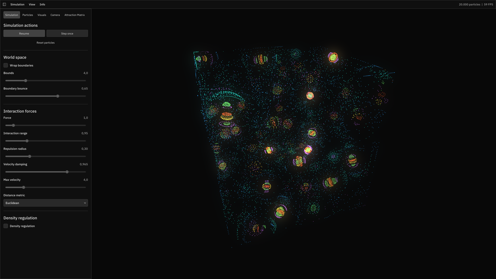

# 3D Particle Simulator

An interactive particle-life sandbox written in Java and OpenGL. Thousands of particles attract and repel each other according to a configurable matrix, producing swarms, clusters, membranes, and other emergent structures.

This project takes the original Particle Life idea into three dimensions and runs the simulation on the GPU.



## Features

- Real-time 3D particle simulation
- Up to 16 particle groups with custom colors
- Editable attraction matrix and several generated patterns
- Random, grid, shell, spiral, disc, cluster, and point spawning
- Free-look camera
- Bouncing or wrap-around world boundaries
- Euclidean, Manhattan, and Chebyshev distance modes
- Optional density regulation
- Particle glow, trails, and multiple color modes
- Preset saving and loading
- Runtime GPU timing and memory statistics
- Built-in particle-capacity benchmark

## Download

Download the latest Windows build from the [Releases page](https://github.com/OlivierVencken/3d-Particle-Simulator/releases/latest), extract the ZIP, and run `3D Particle Simulator.exe`.

The packaged build includes its own Java runtime. It requires Windows 10 or 11 on x64 and a GPU with OpenGL 4.3 support.

## Controls

### Camera

- **Left click**: capture the mouse and control the camera
- **Right click** or **Esc**: release the mouse
- **W / A / S / D**: move
- **Shift**: move up
- **Ctrl**: move down
- **Home**: reset the camera

### Simulation

- **Space**: pause or resume
- **Right arrow**: advance one simulation step
- **R**: reset the particles
- **F**: hide or show the interface
- **F3**: show performance diagnostics
- **F11**: toggle fullscreen

Most simulation and visual settings can be changed from the sidebar while the application is running. Positive attraction values are shown in green, negative values in red.

## How it works

The simulation uses a fixed 1/60-second timestep. Every step is performed with OpenGL compute shaders:

1. Count the particles in each spatial-grid cell.
2. Build exact cell offsets with a hierarchical exclusive scan.
3. Scatter particle IDs into a compact grid.
4. Calculate interactions and write the next particle state.

The grid has no fixed per-cell particle limit and avoids copying the simulation state between the CPU and GPU. Separate input and output buffers keep each update deterministic regardless of GPU scheduling.

Trails are captured during the integration pass, and their memory use is capped. Trail rendering is subsampled for very large workloads. Bloom resolution also scales down as the particle count increases.

## Building from source

Requirements:

- Windows 10 or 11, x64
- JDK 21 or newer
- A GPU and driver with OpenGL 4.3 support

Run the application with the included Maven wrapper:

```powershell
.\mvnw.cmd compile exec:java
```

Run the test suite:

```powershell
.\mvnw.cmd test
```

The regular tests do not require a display or GPU. To also compile the shaders and test the simulation against a CPU reference implementation:

```powershell
.\mvnw.cmd -DgpuTests=true test
```

Create a distributable Windows build:

```powershell
.\scripts\package-windows.ps1
```

The resulting ZIP is written to `target/release`.

## Benchmarking

The benchmark runs in a hidden OpenGL window and searches for the largest particle count that stays within its 60 Hz target:

```powershell
.\mvnw.cmd -q exec:java "-Dexec.args=--benchmark"
```

You can also test a specific particle count or save the result as JSON or CSV:

```powershell
.\mvnw.cmd -q exec:java "-Dexec.args=--benchmark --particles=100000 --warmup=10 --samples=30"
.\mvnw.cmd -q exec:java "-Dexec.args=--benchmark --output=target/benchmark.json"
```

Results depend heavily on the GPU, world size, interaction range, and particle density.

## Inspiration

The project is inspired by Tom Mohr's [Particle Life](https://www.youtube.com/watch?v=p4YirERTVF0). The original idea uses a small attraction matrix to produce complex collective behavior from simple rules.

## License

This project is available under the [MIT License](LICENSE).
